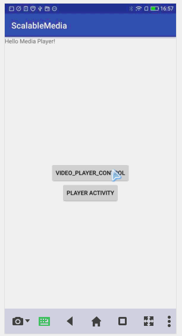

## 新版说明
> 整理并优化了media player管理接口 `VideoPlayerManager` 和 `SingleVideoPlayerManager` 它的简单实现类。并且规范了方法名，去除了一些无用的功能接口， 如：去除了 ~~playNewPrepareUriVideo()~~ 和 ~~playNewPrepareVideo()~~  等接口方法；把*playNewVideo*改为 `playVideo` 等等。规范了log输出规范，去除无用log输出。并且增加了日志本地输出功能，记录运行日志。

### MEDIA PLAYER 控制器

接口 `VideoPlayerManager` 为视频播放的控制器，子类 `SingleVideoPlayerManager` 简单实现了播放视频时的一些简单控制操作。其主要方法有：

播放视频

    void playVideo(VideoPlayerView view, VideoPlayerBean bean);

开始播放　

    void startVideo(VideoPlayerView view);

暂停播放　

    void pauseVideo(VideoPlayerView view);

定位播放位置　

    void seekToVideo(VideoPlayerView view, VideoPlayerBean bean);

停止播放　

    void stopVideo(VideoPlayerView view);

播放状态

    boolean isInPlaybackState();

### MEDIA LOG 日志输出

初始化 设置文件路径、文件名前缀等等

``` Java
    //缓存目录
    MediaLog.mCachePath = this.getFilesDir() + "/mediaLog";
    //文件目录
    MediaLog.mLogPath = Environment.getExternalStorageDirectory() + File.separator+"Medplus/media/log";
    //文件前缀
    MediaLog.mNamePrefix = "MediaPlayer_" + Calendar.getInstance().getTimeInMillis();
    //用户ip
    MediaLog.mNetIp = "192.168.1.1";
    //用户id
    MediaLog.mCustomerId = "5456465465";
    //版本号
    MediaLog.mAppVersion = "v1.10";
    //日志输出级别
    MediaLog.open(Xlog.LEVEL_ALL);
```

使用方法

``` Java
    MediaLog.i("标记", "日志内容", "文件名", "方法名");
    MediaLog.e("标记", "日志内容", "文件名", "方法名");
    ···
```

关闭日志

``` Java
    MediaLog.appenderClose();

```

### 操作回调增加抽象实现

视频状态监听回调

`AbstractMediaPlayerStateListener` 继承自 `MediaPlayerStateListener` 并简单实现的抽象类
``` Java
    mPlayerView.setUIOperationListener(new AbstractMediaPlayerStateListener(){});//设置手势回调
```

手势处理类型监听回调

`AbstractVideoGestureDetectorUiOperationListener` 继承自 `VideoGestureDetectorUiOperationListener` 并简单实现的抽象类
``` Java
    mPlayerView.addMediaPlayerListener(new AbstractVideoGestureDetectorUiOperationListener(){});//设置mediaPlayer状态回调

```


====================================我是分割线====================================


# 视频播放器使用说明

**自定义视频播放器**是以系统原生的MediaPlayer为基础，在此基础之上进行自定义的封装，并实现播放网络视频和本地视频。特点概述：
- **屏幕自适应** 支持视频的大小按用户指定的显示方式进行渲染，渲染方式主要有按宽度、按高度、全部填充等方式。
- **手势控制** 视频播放区域内实现了对用户的手势操作的捕捉，并做出对屏幕亮度（左侧上下滑动）、播放音量（右侧上下滑动）、播放进度（左右滑动）的控制。
- **组合View** 封装带有视频控制的视频播放View，含有播放按钮、进度条、横竖屏旋转按钮、播放时间等。
- **工作线程控制** 使用工作线程处理耗时工作，比如准备播放视频和释放资源时使用工作线程进行操作，防止主线程阻塞。


## 简介

> 使用系统原生MediaPlayer播放流媒体时往往比较繁琐，播放状态难以很好的统一控制，稍有遗漏就会照成异常的出现。
此依赖包就是为了解决上述等问题而诞生的。使用同一封装解决了状态控制在使用时的复杂度，优化了原生MediaPlayer在准备资源时的耗时操作等等。主要目的就是为了更方便的使用，让播放视频更简单更简洁。

从引用依赖包、代码结构、使用示例、注意事项，四部分进行介绍此视频播放器的使用方式。


## 获取依赖

当前版本号为:2.1.1-SNAPSHOT
```
compile 'com.allin.comm:scalablemedialib:1.7'
```


## 代码结构

- **audio** 处理音频相关的都在这里躺着
    - **VoiceManager** 音频管理类，主要用于更改系统音量
- **utils** 工具包
    - **ScreenUtils** 更改屏幕亮度工具类
- **video** 存放着视频播放相关的everything
    - **entity** 视频参数实体相关
    - **manager** 处理播放的相关管理类
        - **PlayerMessageState** 播放状态
        - **SeekBarManager** 进度条管理类
        - **SingleVideoPlayerManager** 视频管理类这个很常用，它是接口VideoPlayerManager的实现类
        - **VideoPlayerManager** 播放控制接口
        - **VideoPlayerManagerCallback**　只要用户接受回调，设置和获取当前视频播放对象以及视频的状态
        - **message** 视频的播放指令都在此目录中
            - **InvokeMessage** 消息的基类
            - **MessagesHandler** 消息处理handler（已弃用）
            - **MessagesHandlerThread** 消息处理HandlerThread
            - ...
    - **ui** 顾名思义这都是现实视频内容的view
        - **OptimizeSurfaceView** 使用surfaceView展示视频内容（已弃用）
        - **OptimizeTextureView** 使用TextureView渲染视频内容
        - **VideoPlayerControlView** 组合view，继承视频显示及视频控制相关控件
        - **VideoPlayerView** 在显示简单渲染视频内容之上的一次封装，实现手势等相关功能
        - **wrapper** 此目录中内容主要是对原生MediaPlayer的包装
            - **MediaPlayerWrapper** MediaPlayer管理类


## 使用示例

第一步，资源文件中引用视频渲染控件
``` Java
    <!--视频播放器-->
    <net.medplus.social.media.video.ui.VideoPlayerView
        android:id="@+id/vpv_video_player"
        android:layout_width="match_parent"
        android:layout_height="match_parent"/>
```

第二布，初始化 并且设置相关参数
``` Java
    VideoPlayerView mPlayerView = (VideoPlayerView) findViewById(R.id.vpv_video_player);
    mPlayerView.setKeepScreenOn(true);//设置常亮
    mPlayerView.setGestureDetectorValid(false);//设置手势
    mPlayerView.setUIOperationListener(this);//设置手势回调
    mPlayerView.setSurfaceTextureListener(this);//设置surfaceTexture状态回调
    mPlayerView.addMediaPlayerListener(this);//设置mediaPlayer状态回调
    mPlayerView.setViewScaleType(OptimizeTextureView.SCALE_TYPE_FILL);//设置视频缩放模式 按宽高填充
```
第三步，初始化视频管理工具
``` Java
    VideoPlayerManager mPlayerManager = new SingleVideoPlayerManager();
```

第四部，实现相关回调 `MediaPlayerStateListener` `surfaceTextureListener` `VideoGestureDetectorUIOperationListener`
``` Java
    //MediaPlayerWrapper.MediaPlayerStateListener
    @Override
    public void onErrorCallback(MediaPlayer mp, int what, int extra) {
        //视频错误回调
    }

    @Override
    public void onInfoCallback(MediaPlayer mp, int what, int extra) {
        //视频状态回调
    }

    @Override
    public void onBufferingUpdateCallback(MediaPlayer mp, int percent) {
        //视频缓存中会调用此方法
    }

    @Override
    public void onCompletionCallback(MediaPlayer mp) {
        //视频播放完成后会调用此方法
    }

    @Override
    public void onSeekCompleteCallback(MediaPlayer mp) {
        //设置播放位置完成时会调用此方法
    }

    @Override
    public void onVideoSizeChangedCallback(MediaPlayer mp, int width, int height) {
        //视频大小改变时会调用吃方法
    }

    @Override
    public void onPreparedCallback(MediaPlayer mp) {
        //当视频准备完成是会调用此方法
    }

    @Override
    public void onVideoStartCallback() {
        //视频播放时会调用此方法
    }

    @Override
    public void onVideoStoppedCallback() {
        //视频停止播放时会调用此方法
    }

    @Override
    public void onVideoPauseCallback() {
        //视频暂停时会回调此方法
    }

```

``` Java
    //surfaceTextureListener 空实现即可
    @Override
    public void onSurfaceTextureAvailable(SurfaceTexture surface, int width, int height) {

    }

    @Override
    public void onSurfaceTextureSizeChanged(SurfaceTexture surface, int width, int height) {

    }

    @Override
    public boolean onSurfaceTextureDestroyed(SurfaceTexture surface) {
        return false;
    }

    @Override
    public void onSurfaceTextureUpdated(SurfaceTexture surface) {

    }
```

``` Java
    //手势回调 VideoGestureDetectorUIOperationListener
    @Override
    public void onGestureDetectorByScreenLuminance(boolean screenType, int number, int percent) {
        //亮度操作回调
    }

    @Override
    public void onGestureDetectorByVolume(boolean volumeType, int number, int percent) {
        //声音操作回调
    }

    @Override
    public void onGestureDetectorByProgress(boolean progressType, int number, int percent) {
        //进度操作回调
    }

    @Override
    public void onGestureDetectorCancel(int gestureType) {
        //手指按下后抬起的操作回到 相当于点对视频渲染View的击事件
    }
```

设置视频url 播放位置等
``` Java
VideoPlayerBean mVideoPlayerBean = new VideoPlayerBean();
mVideoPlayerBean.setPosition(currentPosition);
mVideoPlayerBean.setUrl(url);
```

播放视频，对本地视频和网络视频都适用
``` Java
mPlayerManager.playNewSeekToStartVideo(mPlayerView, mVideoPlayerBean);//播放视频
```

暂停视频
``` Java
mPlayerManager.pauseVideo();
```

释放视频播放器占用的资源
``` Java
mPlayerManager.resetMediaPlayer();
```


## 注意事项

- 一定要严格控制视频的状态。比如回调onErrorCallback这个方法后MediaPlayer已为Error状态，则不能进行播放、暂停操作，否则会报异常。
- 在activity停止或者销毁的时候应要调用resetMediaPlayer()方法释放视频资源。
- mPlayerView.setGestureDetectorValid(false);设置手势的方法一定要在开始播放的时候设为true，其他状态应为false，否者也会报错。
- 在回调方法中做操作时一定要验证当前activity是否已销毁。




